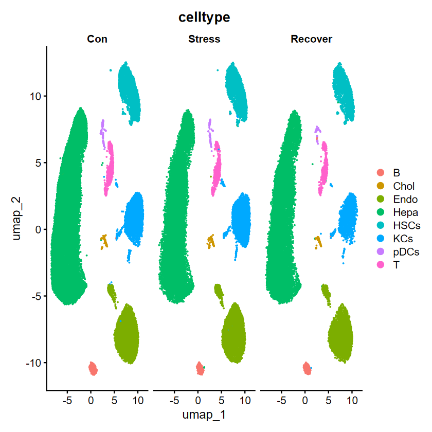
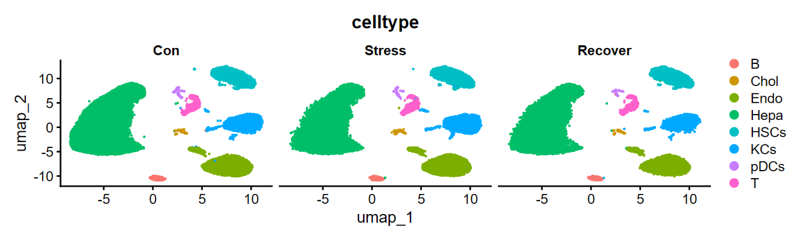
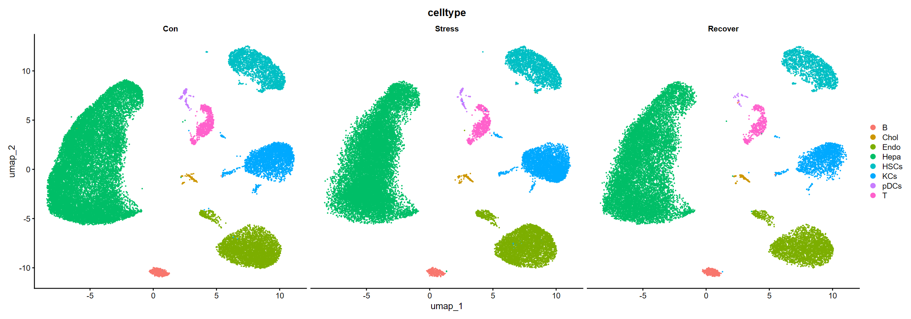

# 第一步


```R
setwd("E:/scRNAseq_try/test/")
rm(list=ls())
options(stringsAsFactors = F) 
source('E:/服务器备份/scRNA_scripts/lib.R')
```

    Loading required package: Rcpp
    
    
    Attaching package: 'dplyr'
    
    
    The following objects are masked from 'package:stats':
    
        filter, lag
    
    
    The following objects are masked from 'package:base':
    
        intersect, setdiff, setequal, union
    
    
    Loading required package: SeuratObject
    
    Loading required package: sp
    
    
    Attaching package: 'SeuratObject'
    
    
    The following objects are masked from 'package:base':
    
        intersect, t
    
    
    Loading required package: ggraph
    
    Loading required package: ggplot2
    
    
    Attaching package: 'ggraph'
    
    
    The following object is masked from 'package:sp':
    
        geometry
    
    
    
    Attaching package: 'data.table'
    
    
    The following objects are masked from 'package:dplyr':
    
        between, first, last
    
    
    
    Attaching package: 'patchwork'
    
    
    The following object is masked from 'package:cowplot':
    
        align_plots
    
    
    

# 第二步
## 哈哈哈


```R
setwd("./5-My_Annotation") 
sce.all.int<-readRDS("sce.all.int9重新注释20240718.rds")
DimPlot(sce.all.int,reduction = "umap",group.by = "celltype",
        split.by = "group")
```


    

    


```R
是哒阿萨德阿萨德啊
```


```R
options(repr.plot.width=10,repr.plot.height=3)
DimPlot(sce.all.int,reduction = "umap",group.by = "celltype",
        split.by = "group")
```


    

    


```R
options(repr.plot.width=20,repr.plot.height=7)
DimPlot(sce.all.int,reduction = "umap",group.by = "celltype",
        split.by = "group")
```


    

    


```R
getwd()
```


'E:/scRNAseq_try/test/5-My_Annotation'


```R

```
